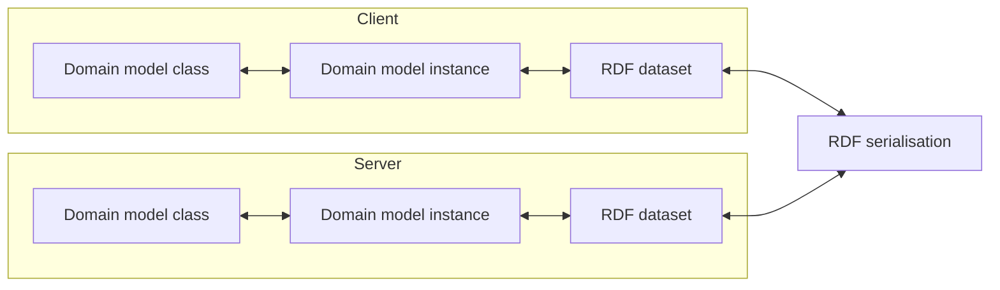
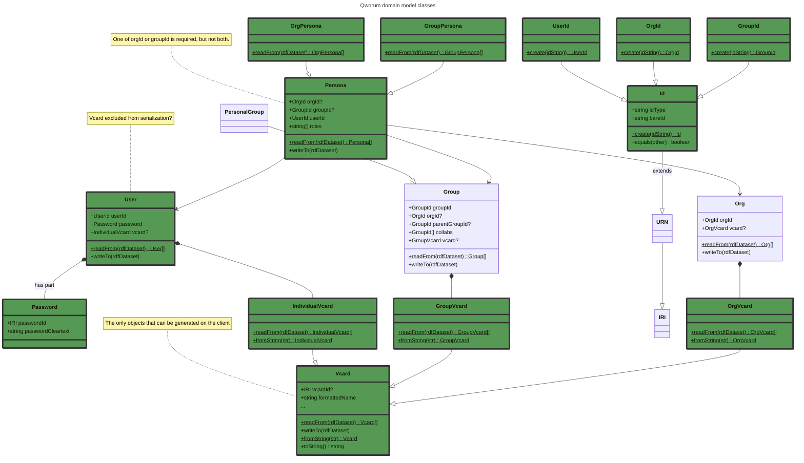
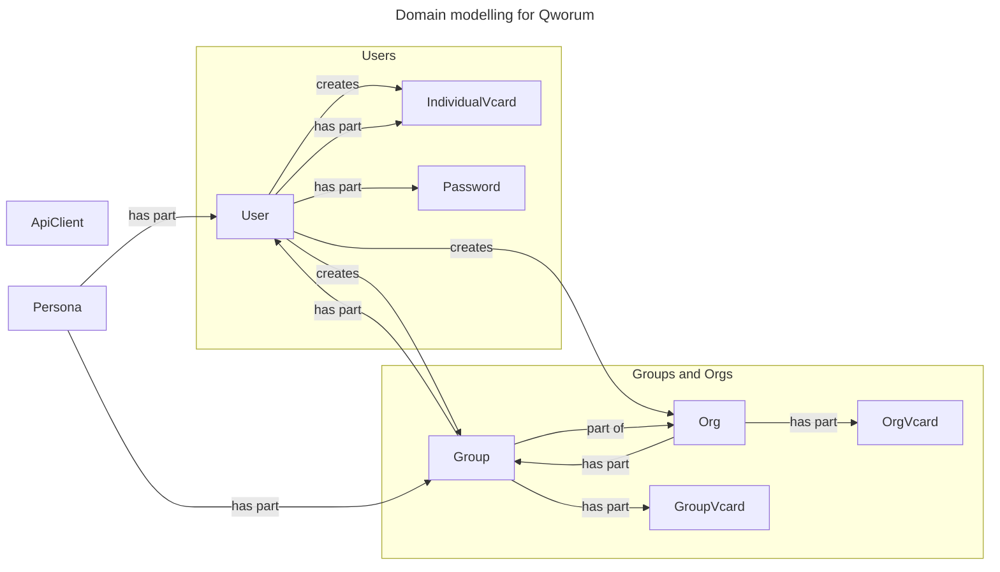
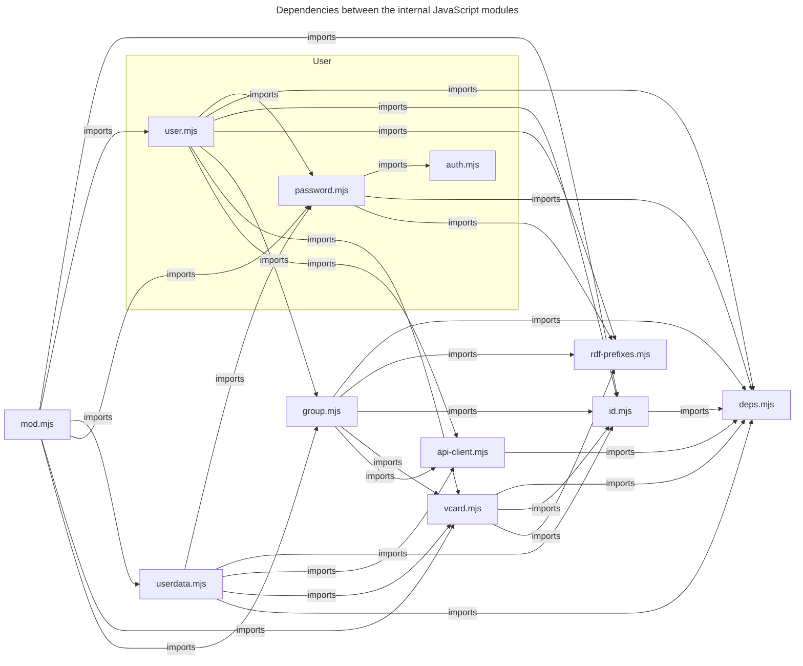
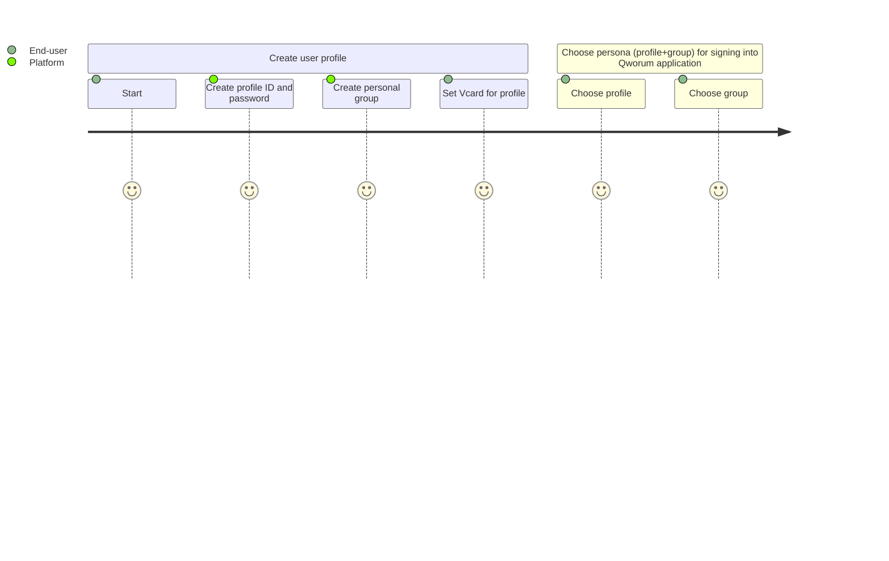
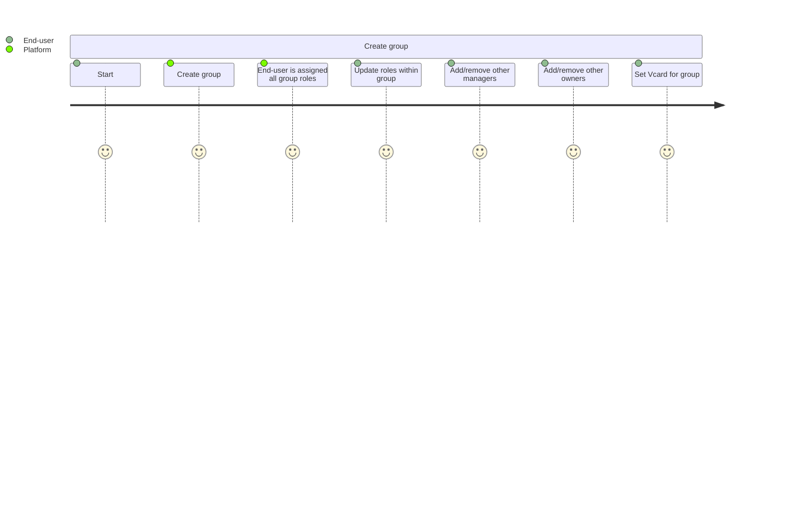
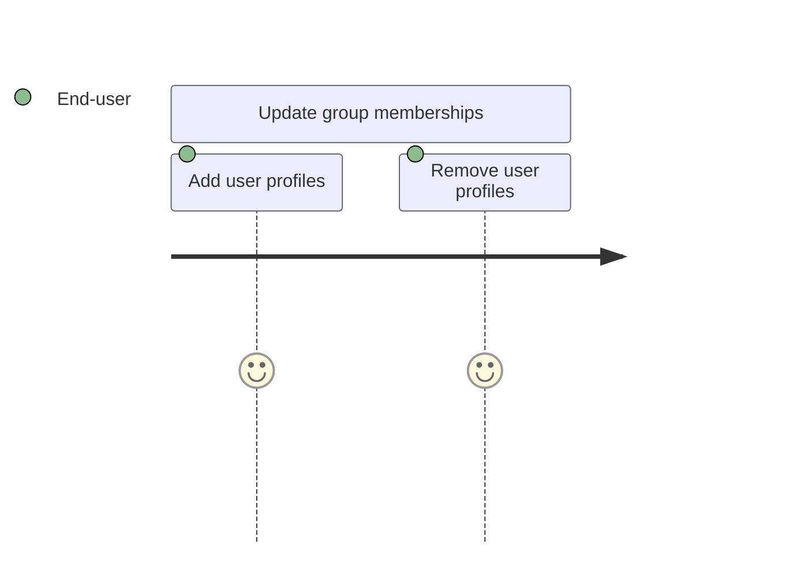
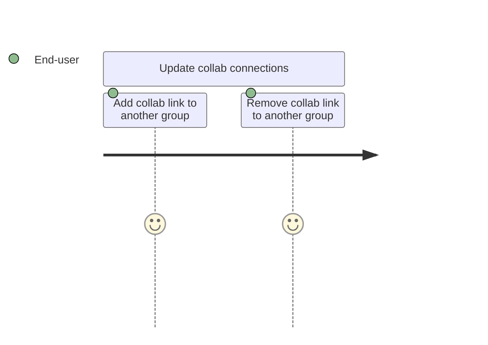
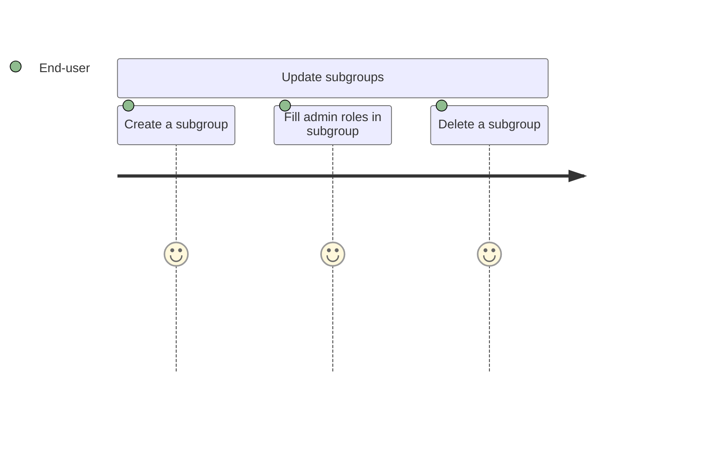

<p align="left">
<a href="https://qworum.net" target="_blank" rel="noreferrer"></a>
</p>

# Qworum domain model

A JavaScript client library that provides classes that collectively represent Qworum's domain model. This library is/will be used by:

- Qworum's API server at the backend.
- The [Qworum browser extension](https://chromewebstore.google.com/detail/qworum-the-service-web/leaofcglebjeebmnmlapbnfbjgfiaokg).
- The [Qworum JavaScript library](https://github.com/doga/qworum-for-web-pages) that is used for developing Qworum applications and services.

## Usage examples

<details data-mdrb>
<summary>Calling an API endpoint</summary>

<pre>
description = '''

'''
</pre>
</details>

```javascript
import {User} from "./mod.mjs";
// TODO
```

Sample output for the code above:

```text

```

_Tip: Run the examples below by typing this in your terminal (requires [Deno](https://deno.com/) 2+):_

```shell
deno run --allow-net --allow-run --allow-env --allow-read jsr:@andrewbrey/mdrb@3.0.4 --dax=false --mode=isolated README.md
```

## Lifecycle of a domain model instance

1. On the client side, domain model instances are first put into an in-memory RDF dataset.
1. This dataset is then serialised into a text format before being sent to the server.
1. The server does the reverse, by using the same domain model.

What is meant by a client and a server:

- Client: a Qworum application or service. Server: the Qworum browser extension.
- Client: the Qworum browser extension. Server: the Qworum API in the cloud.



## Internal workings

The `ApiClient` class is available in `mod.mjs` and it is used directly for making API calls. The other classes don't make API calls behind the scenes. Each class has a `static from(rdfDataset)` method to create an object, except `ApiClient`. `ApiClient` imports all other classes.



`Persona` roles are 'owner', 'root groups manager', 'subgroups manager', 'collabs manager', 'memberships manager', 'member'.





```mermaid
---
title: External dependencies
---
flowchart LR
  deps[deps.mjs]
  iri[@doga/IRI]
  rdfTerms[@rdfjs/data-model]
  rdfDataset[@rdfjs/dataset]
  rdfJson[@doga/rdf-json-parser]
  base64[@doga/base64]
  ical[@kewisch/ical.js]

  deps -- imports --> iri
  deps -- imports --> rdfTerms
  deps -- imports --> rdfDataset
  deps -- imports --> rdfJson
  deps -- imports --> base64
  deps -- imports --> ical

  click base64 "https://github.com/doga/base64" _blank
  click iri "https://github.com/doga/IRI" _blank
  click rdfJson "https://github.com/doga/rdf-json-parser" _blank
  click rdfTerms "https://github.com/rdfjs/data-model" _blank
  click rdfDataset "https://github.com/rdfjs/dataset" _blank
  click ical "https://github.com/kewisch/ical.js" _blank
```

## User journeys

TODO Org groups manager journey.

### Typical user journey for a simple user

The user is initially assigned all roles within his/her personal group:

- owner
- membership manager
- collab manager
- member

Personal groups don't have a `subgroups manager` role.



### Typical user journey for a group owner

The group owner is initially also assigned all other roles within the group:

- membership manager
- collab manager
- member



### Typical user journey for a membership manager

TODO: member roles.



### Typical user journey for a collab manager

Collabs are for multi-group teamwork. Collab connections must be 2-way to be valid, the others are only collab proposals pending confirmation by the other party.



### Typical user journey for a subgroups manager

A group can have subgroups. Subgroup members are a members of the parent group; no such restriction for admin roles.



∎
