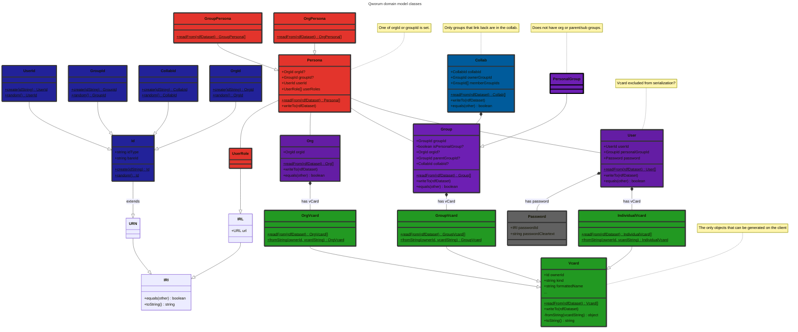
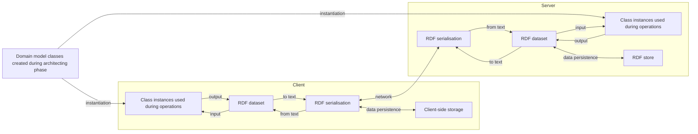

<p align="left">
<a href="https://qworum.net" target="_blank" rel="noreferrer"></a>
</p>

# Qworum domain model

A JavaScript client library that provides classes that collectively represent Qworum's domain model. The focus is on the usage of Qworum applications/services. The primary classes that are defined are:

- `Org`,
- `Group`,
- `Collab`,
- `User`.

This library is/will be used by:

- Qworum's API server at the backend.
- The [Qworum browser extension](https://chromewebstore.google.com/detail/qworum-the-service-web/leaofcglebjeebmnmlapbnfbjgfiaokg).
- The [Qworum JavaScript library](https://github.com/doga/qworum-for-web-pages) that is used for developing Qworum applications and services.

## Domain model in detail



In a `Persona`, allowed user roles are _owner_, _root groups manager_ (for orgs), _subgroups manager_ (for groups that are not personal groups), _collabs manager_ (for all groups), _memberships manager_, _member_. All roles except _member_ are manager roles. Managers and members are collectively called _participants_.

The members of a group are all members of the parent group or org. If a group belongs to an org, then all managers of the group must be members of the org. If a group doesn't belong to an org, then anyone can be a group manager if the group owner sees it fit.

Collabs are for multi-group teamwork. Collab connections must be 2-way to be valid, the others are only collab proposals pending confirmation by the other party. Here is how it works:

1. A collab manager in a group creates a collab object and adds the IDs of groups that he/she wishes to invite to the collab.
1. Any previous collab object that the group was linking to is forgotten by that group. Groups can link to one collab at most at any given time.
1. The collab managers of the invited groups are notified and can link their group to the collab.
1. A collab is for Internet-wide teamwork; it is valid for all Qworum applications.

## Lifecycle of a domain model

1. On the client side, domain model instances are first put into an in-memory RDF dataset.
1. This dataset is then serialised into a text format before being sent to the server.
1. The server does the reverse, by using the same domain model.

What is meant by a client and a server:

- Client: a Qworum application or service. Server: the Qworum browser extension.
- Client: the Qworum browser extension. Server: the Qworum API in the cloud.

The following are out-of-scope for this domain model:

- RDF serialisation,
- Data persistence.



## Usage example

<details data-mdrb>
<summary>Handle personas</summary>

<pre>
description = '''
Create a persona that assigns roles to a user within an organisation.
'''
</pre>
</details>

```typescript
import rdf from 'https://esm.sh/gh/rdfjs/dataset@v2.0.2';

import { 
  OrgId, bareorgid, bareuserid,
  OrgPersona, ownerRole, rootGroupsManagerRole, subgroupsManagerRole, collabManagerRole, membershipsManagerRole, memberRole,
} from 'https://esm.sh/gh/doga/qworum-domain-model@0.9.2/mod.mjs';

type PersonaType = {
  orgId    : any,
  groupId  : any,
  userId   : any,
  userRoles: any,
};

// Create a persona that assigns roles to a user within an organisation.
const
orgId     = bareorgid`w-5678`,
userId    = bareuserid`r-1234`,
userRoles = [ownerRole, rootGroupsManagerRole, membershipsManagerRole, memberRole],
personaIn = new OrgPersona({orgId, userId, userRoles} as PersonaType),
dataset   = rdf.dataset();

// Write the persona to an RDF dataset and read it back.
personaIn.writeTo(dataset);
const orgPersonas = OrgPersona.readFrom(dataset);

// Print out the persona.
console.group(`Org ID: ${orgId}`);
for (const persona of orgPersonas) {
  console.group(`User ID: ${persona.userId}`);
  console.group('Role IDs:');
  for (const userRole of persona.userRoles) {
    console.debug(`${userRole}`);
  }
  console.groupEnd();
  console.groupEnd();
}
console.groupEnd();
```

Sample output for the code above:

```text
Org ID: urn:qworum:org:w-5678
    User ID: urn:qworum:user:r-1234
        Role IDs:
            https://vocab.qworum.net/id/role/owner
            https://vocab.qworum.net/id/role/root-groups-manager
            https://vocab.qworum.net/id/role/memberships-manager
            https://vocab.qworum.net/id/role/member
```

### Running the usage example

Run the examples above by typing this in your terminal (requires [Deno](https://deno.com/) 2+):

```shell
deno run --allow-net --allow-run --allow-env --allow-read jsr:@andrewbrey/mdrb@3.0.4 --dax=false --mode=isolated https://raw.githubusercontent.com/doga/qworum-domain-model/refs/heads/main/README.md
```

∎
