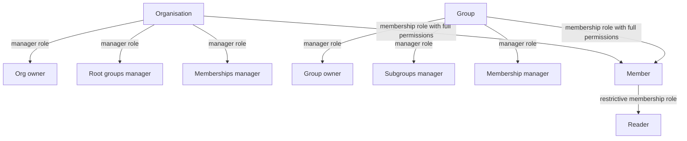
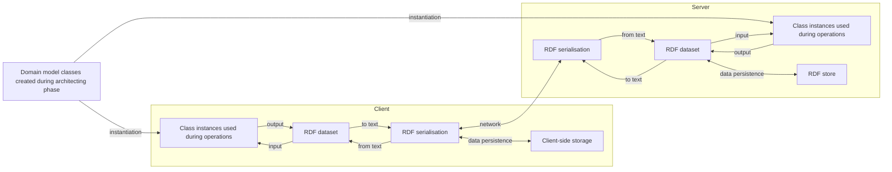

<p align="left">
<a href="https://qworum.net" target="_blank" rel="noreferrer"></a>
</p>

# Qworum domain model

A JavaScript client library that provides classes that collectively represent Qworum's domain model. The focus is on the usage of Qworum applications/services. The primary classes that are defined are:

- `Org`,
- `Group`,
- `Membership`,
- `User`.

Each domain object can be read from, and written to, an [RDF dataset](https://rdf.js.org/dataset-spec/#datasetcore-interface).

This library is/will be used by:

- Qworum's API server at the backend.
- The [Qworum browser extension](https://chromewebstore.google.com/detail/qworum-the-service-web/leaofcglebjeebmnmlapbnfbjgfiaokg).
- The [Qworum JavaScript library](https://github.com/doga/qworum-for-web-pages) that is used for developing Qworum applications and services.

## Domain model in some detail

```mermaid
---
title: The main Qworum domain model classes
---
classDiagram
  class IRI{
  }
  class URN{
  }
  class Id{
    +string idType
    +string bareId
  }
  class UserId{
  }
  class GroupId{
  }
  class MembershipId{
  }
  class PartnershipId{
  }
  class PartnershipMembershipId{
  }
  class OrgId{
  }
  class RoleId{
  }
  class Role{
    +RoleId roleId
    +I18nText description
  }
  class User{
    +UserId userId
    +GroupId[] groupIds
    +OrgId[] orgIds
    +Password password
  }
  class Group{
    +GroupId groupId
    +boolean isPersonalGroup
    +OrgId orgId?
    +GroupId parentGroupId?
    +PartnershipId[] partnershipIds
    +UserId[] ownerIds
    +UserId[] subgroupsManagerIds
    +UserId[] partnershipManagerIds
    +UserId[] membershipsManagerIds
    +UserId[] memberIds
  }
  class Persona{
    +UserId userId
    +GroupId groupId
    +RoleId[] userRoles
    +RoleId[] groupRoles
    +GroupId[] partnerGroupIds
    +userFitsAnyOf(roles ) boolean
    +userIdSha256() string
    +groupIdSha256() string
  }
  class Membership{
    +MembershipId membershipId
    +GroupId groupId
    +UserId userId
    +TemporalEntity[] validityPeriods
    +RoleId[] roles
  }
  class Partnership{
    +PartnershipId partnershipId
    +GroupId ownerId
    +GroupId[] memberIds
  }
  class PartnershipMembership{
    +PartnershipMembershipId partnerMembershipId
    +PartnershipId partnershipId
    +GroupId groupId
    +TemporalEntity[] validityPeriods
    +RoleId[] roles
  }
  class Org{
    +OrgId orgId
    +UserId[] ownerIds
    +UserId[] rootGroupsManagerIds
    +UserId[] membershipsManagerIds
    +UserId[] memberIds
  }

  class Vcard{
    +Id ownerId
    +string kind
    +string formattedName
    ...
  }
  class IndividualVcard{
  }
  class GroupVcard{
  }
  class OrgVcard{
  }

  note for Membership "Annotation on the 'member' link going from a Group to a User"
  note for PartnershipMembership "Annotation on the 'member' link going from a Partnership to a Group"
  note for Partnership "Groups must link back"
  note for Org "Users must link back"
  note for Group "Users must link back"
  note for Persona "The end-user, as seen by Qworum services"

  URN --|> IRI
  IRL --|> IRI
  RoleId --|> IRL
  Id --|> URN : extends
  RoleId -- Role
  UserId --|> Id
  OrgId --|> Id
  GroupId --|> Id
  MembershipId --|> Id
  PartnershipMembershipId --|> Id
  PartnershipId --|> Id
  IndividualVcard --|> Vcard
  GroupVcard --|> Vcard
  OrgVcard --|> Vcard
  PersonalGroup --|> Group
  Org *-- OrgVcard : has vCard
  Group *-- GroupVcard : has vCard
  Group *-- User : member
  Group *-- User : owner
  Group *-- User : subgroupsManager
  Group *-- User : collabManager
  Group *-- User : membershipsManager
  Org -- User : owner
  Org -- User : rootGroupsManager
  Org -- User : membershipsManager
  Org -- User : member
  Persona *-- User : user
  Persona *-- Group : the group that the user is acting on behalf of
  Partnership *-- Group : owner
  Partnership *-- Group : member
  Partnership *-- RoleId : role of partner group's member
  User *-- IndividualVcard : has vCard
 

  style Id fill:#229,stroke:#333,stroke-width:4px
  style UserId fill:#229,stroke:#333,stroke-width:4px
  style PasswordId fill:#229,stroke:#333,stroke-width:4px
  style GroupId fill:#229,stroke:#333,stroke-width:4px
  style MembershipId fill:#229,stroke:#333,stroke-width:4px
  style PartnershipMembershipId fill:#229,stroke:#333,stroke-width:4px
  style PartnershipId fill:#229,stroke:#333,stroke-width:4px
  style OrgId fill:#229,stroke:#333,stroke-width:4px

  style Org fill:#641DA4,stroke:#333,stroke-width:4px
  style Group fill:#6D1FB3,stroke:#333,stroke-width:4px
  style Partnership fill:#6D1FB3,stroke:#333,stroke-width:4px
  style PersonalGroup fill:#6D1FB3,stroke:#333,stroke-width:4px
  style User fill:#641DA4,stroke:#333,stroke-width:4px
  style Password fill:#616161,stroke:#333,stroke-width:4px

  style Vcard fill:#292,stroke:#333,stroke-width:4px
  style IndividualVcard fill:#292,stroke:#333,stroke-width:4px
  style GroupVcard fill:#292,stroke:#333,stroke-width:4px
  style OrgVcard fill:#292,stroke:#333,stroke-width:4px

  style Role fill:#AE251C,stroke:#333,stroke-width:4px
  style RoleId fill:#AE251C,stroke:#333,stroke-width:4px
  style Membership fill:#AE251C,stroke:#333,stroke-width:4px
  style PartnershipMembership fill:#AE251C,stroke:#333,stroke-width:4px

  style Persona fill:#4C6C31,stroke:#333,stroke-width:4px
```



In a `Group` or `Org`, the allowed user roles are _owner_, _root groups manager_ (for orgs), _subgroups manager_ (for groups that are not personal groups), _collab manager_ (for all groups), _memberships manager_, _member_. All roles except _member_ are manager roles. Managers and members are collectively called _participants_.

By default, a group membership grants the user full permissions when using Qworum-based services. User permissions may be made more restrictive through `Membership` annotations on group membership relations. For example a group member may be given a read-only access to Qworum-based services.

Note that memberships can have many dimensions beyond member roles. For example memberships may be active:

- only during specified time periods.
- only after a certain event has occurred.
- only if the user has a certain type of credential.

Similary to how the actions of the members of a group can be restricted through personas, the actions of all members of a member group within collab can also be restricted through `Partnership`s.

For users that are members of a group which are in turn partners in a `Partnership`, an action is only allowed in a Qworum service if:

- at least one of the `Partnership` rules of the user's group allows the action, __and__
- at least one of the `Membership` rules of the user within the group allows the action.

A `Membership` is a [reification](https://www.w3.org/TR/rdf12-concepts/#section-triple-terms-reification) (a statement about a membership statement).



The members of a group are all members of the parent group or org. If a group belongs to an org, then all managers of the group must be members of the org. If a group doesn't belong to an org, then anyone can be a group manager if the group owner sees it fit.

`Partnership`s are for multi-group teamwork. Partnership connections must be 2-way to be valid, the others are only partnership proposals pending confirmation by the other party.

A group can have at most one partnership that is active at any given time. If multiple partnerships are eligible, then only one of them is chosen at random by the Qworum platform.

Here is how it works:

1. A partnership manager in a group creates a `Partnership` object and adds the IDs of the partner groups that he/she wishes to invite to the partnership.
1. The partnership managers of the partner groups are notified and can link their group to the partnership.
1. A partnership is for Internet-wide teamwork; it is valid on all Qworum applications.

## Lifecycle of a domain model

1. On the client side, domain model instances are first put into an in-memory RDF dataset.
1. This dataset is then serialised into a text format before being sent to the server.
1. The server does the reverse, by using the same domain model.

What is meant by a client and a server:

- Client: a Qworum application or service. Server: the Qworum browser extension.
- Client: the Qworum browser extension. Server: the Qworum API in the cloud.

The following are out-of-scope for this domain model:

- RDF serialisation,
- Data persistence.



## Usage example

<details data-mdrb>
<summary>Handle group memberships</summary>

<pre>
description = '''
Restrict the role of a group member to a read-only capacity.
'''
</pre>
</details>

```javascript
import { 
  IriParser, IRI, iri, URN, urn, IRL, irl, url, 

  Id, OrgId, GroupId, UserId, PasswordId, MembershipId, PartnershipId, PartnershipMembershipId, RoleId,
  orgid, group_id, user_id, membership_id, partnership_id, partnership_membership_id, role_id,
  bareorgid, baregroup_id, bareuser_id, barepartnership_id,

  I18nText, Language,

  Org, Group, PersonalGroup, Membership, Partnership, PartnershipMembership, Password, User, Role, wellKnownRoles,

  Vcard, IndividualVcard, GroupVcard, OrgVcard, Name, Email, EmailUrl, Phone, PhoneUrl, Photo, Address, 

  Persona
} from 'https://esm.sh/gh/doga/qworum-domain-model@0.10.1/mod.mjs';

const
// Create a group
user1_Id  = UserId.uuid(),
user2_Id  = UserId.uuid(),
ownerIds  = [user1_Id],
memberIds = [user1_Id, user2_Id],
groupIn   = new Group({ownerIds, memberIds}),

// Create membership restrictions for a member
membershipIn = new Membership({
  userId : user2_Id,
  groupId: groupIn.groupId,
  roleIds: [wellKnownRoles.reader.roleId] // user has read-only access to group data
});

// Store the group and membership in an in-memory RDF dataset
const dataset = groupIn.toDataset();
membershipIn.writeTo(dataset);

// Now read the data back
const
groupOut      = Group.readOneFrom(dataset),
membershipOut = Membership.readOneFrom(dataset);

// Print out the group.
console.group(`Group <${groupOut.groupId}>`);
console.group(`Owners`);
for (const ownerId of groupOut.ownerIds) {
  console.info(`<${ownerId}>`);
}
console.groupEnd();
console.group(`Members`);
for (const memberId of groupOut.memberIds) {
  console.info(`<${memberId}>`);
}
console.groupEnd();
console.groupEnd();

// Print out the membership restrictions.
console.group(`Membership <${membershipOut.membershipId}>`);
console.info(`Group <${membershipOut.groupId}>`);
console.info(`User  <${membershipOut.userId}>`);
console.group(`Roles`);
for (const roleId of membershipOut.roleIds) {
  console.info(`<${roleId}>`);
}
console.groupEnd();
console.groupEnd();
```

Sample output for the code above:

```text
Group <urn:qworum:group:09a0a7e4-ce6e-49c3-bfec-39bb82f9752d>
    Owners
        <urn:qworum:user:067de11a-af79-4bbf-9f2c-93309225f2ea>
    Members
        <urn:qworum:user:067de11a-af79-4bbf-9f2c-93309225f2ea>
        <urn:qworum:user:8ee6cc60-8b04-4815-8c9e-6d444d2d518f>
Membership <urn:qworum:membership:1d254b89-e77c-4518-8d14-1096d10e1747>
    Group <urn:qworum:group:09a0a7e4-ce6e-49c3-bfec-39bb82f9752d>
    User  <urn:qworum:user:8ee6cc60-8b04-4815-8c9e-6d444d2d518f>
    Roles
        <https://vocab.qworum.net/id/role/reader>
```

### Running the usage example

Run the example above by typing this in your terminal (requires [Deno](https://deno.com/) 2+):

```shell
deno run --allow-net --allow-run --allow-env --allow-read jsr:@andrewbrey/mdrb@3.0.4 --dax=false --mode=isolated https://raw.githubusercontent.com/doga/qworum-domain-model/refs/heads/main/README.md
```

∎
