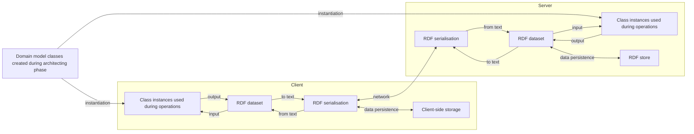
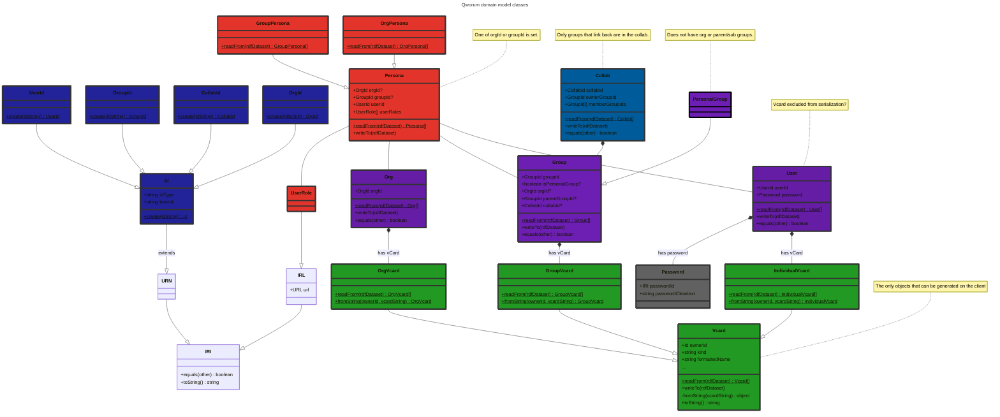

<p align="left">
<a href="https://qworum.net" target="_blank" rel="noreferrer"></a>
</p>

# Qworum domain model

A JavaScript client library that provides classes that collectively represent Qworum's domain model. The focus is on the usage of Qworum applications/services. The primary classes that are defined are:

- `Org`,
- `Group`,
- `User`.

This library is/will be used by:

- Qworum's API server at the backend.
- The [Qworum browser extension](https://chromewebstore.google.com/detail/qworum-the-service-web/leaofcglebjeebmnmlapbnfbjgfiaokg).
- The [Qworum JavaScript library](https://github.com/doga/qworum-for-web-pages) that is used for developing Qworum applications and services.

## Usage examples

<details data-mdrb>
<summary>Calling an API endpoint</summary>

<pre>
description = '''

'''
</pre>
</details>

```javascript
import {User} from "./mod.mjs";
// TODO usage example
```

Sample output for the code above:

```text

```

_Tip: Run the examples below by typing this in your terminal (requires [Deno](https://deno.com/) 2+):_

```shell
deno run --allow-net --allow-run --allow-env --allow-read jsr:@andrewbrey/mdrb@3.0.4 --dax=false --mode=isolated README.md
```

## Lifecycle of a domain model

1. On the client side, domain model instances are first put into an in-memory RDF dataset.
1. This dataset is then serialised into a text format before being sent to the server.
1. The server does the reverse, by using the same domain model.

What is meant by a client and a server:

- Client: a Qworum application or service. Server: the Qworum browser extension.
- Client: the Qworum browser extension. Server: the Qworum API in the cloud.

The following are out-of-scope for this domain model:

- RDF serialisation,
- Data persistence.



## Domain model in detail



In a `Persona`, allowed user roles are _owner_, _root groups manager_ (for orgs), _subgroups manager_ (for groups that are not personal groups), _collabs manager_ (for all groups), _memberships manager_, _member_. All roles except _member_ are manager roles. Managers and members are collectively called _participants_.

The members of a group are all members of the parent group or org. If a group belongs to an org, then all managers of the group must be members of the org. If a group doesn't belong to an org, then anyone can be a group manager if the group owner sees it fit.

Collabs are for multi-group teamwork. Collab connections must be 2-way to be valid, the others are only collab proposals pending confirmation by the other party.

∎
