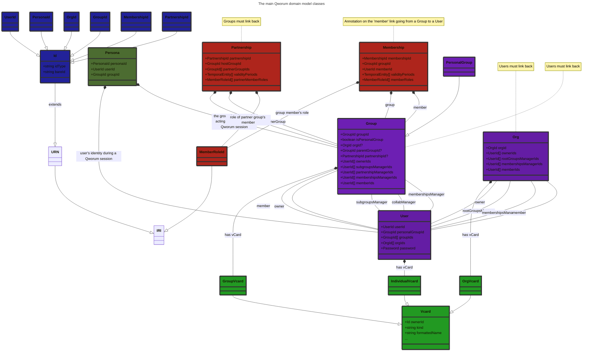

<p align="left">
<a href="https://qworum.net" target="_blank" rel="noreferrer"></a>
</p>

# Qworum domain model

A JavaScript client library that provides classes that collectively represent Qworum's domain model. The focus is on the usage of Qworum applications/services. The primary classes that are defined are:

- `Org`,
- `Group`,
- `Membership`,
- `User`.

Each domain object can be read from, and written to, an [RDF dataset](https://rdf.js.org/dataset-spec/#datasetcore-interface).

This library is/will be used by:

- Qworum's API server at the backend.
- The [Qworum browser extension](https://chromewebstore.google.com/detail/qworum-the-service-web/leaofcglebjeebmnmlapbnfbjgfiaokg).
- The [Qworum JavaScript library](https://github.com/doga/qworum-for-web-pages) that is used for developing Qworum applications and services.

## Domain model in some detail



In a `Group` or `Org`, the allowed user roles are _owner_, _root groups manager_ (for orgs), _subgroups manager_ (for groups that are not personal groups), _collab manager_ (for all groups), _memberships manager_, _member_. All roles except _member_ are manager roles. Managers and members are collectively called _participants_.

By default, a group membership grants the user full permissions when using Qworum-based services. User permissions may be made more restrictive through `Membership` annotations on group membership relations. For example a group member may be given a read-only access to Qworum-based services.

Note that memberships can have many dimensions beyond member roles. For example:

- memberships may be active only during specified time periods.
- memberships may be activated only after a certain event has occurred.

Similary to how the actions of the members of a group can be restricted through personas, the actions of all members of a member group within collab can also be restricted through `Partnership`s.

For users that are members of a group which are in turn members of a collab, an action is only allowed if:

- at least one of the `Partnership` rules of the user's group allows the action, __and__
- at least one of the `Membership` rules of the user within the group allows the action.

A `Membership` is a [reification](https://www.w3.org/TR/rdf12-concepts/#section-triple-terms-reification) (a statement about a membership statement).


The members of a group are all members of the parent group or org. If a group belongs to an org, then all managers of the group must be members of the org. If a group doesn't belong to an org, then anyone can be a group manager if the group owner sees it fit.

Memberships are for multi-group teamwork. Membership connections must be 2-way to be valid, the others are only collab proposals pending confirmation by the other party. Here is how it works:

1. A collab manager in a group creates a collab object and adds the IDs of groups that he/she wishes to invite to the collab.
1. Any previous collab object that the group was linking to is forgotten by that group. Groups can link to one collab at most at any given time.
1. The collab managers of the invited groups are notified and can link their group to the collab.
1. A collab is for Internet-wide teamwork; it is valid for all Qworum applications.

## Lifecycle of a domain model

1. On the client side, domain model instances are first put into an in-memory RDF dataset.
1. This dataset is then serialised into a text format before being sent to the server.
1. The server does the reverse, by using the same domain model.

What is meant by a client and a server:

- Client: a Qworum application or service. Server: the Qworum browser extension.
- Client: the Qworum browser extension. Server: the Qworum API in the cloud.

The following are out-of-scope for this domain model:

- RDF serialisation,
- Data persistence.


## Usage example

<details data-mdrb>
<summary>Handle personas</summary>

<pre>
description = '''
Restrict the role of a group member to a read-only capacity.
'''
</pre>
</details>

```javascript
import { 
  IriParser, IRI, iri, URN, urn, IRL, irl, url, 
  Id, OrgId, orgid, GroupId, groupid, MembershipId, collabid, UserId, userid, PersonaId, personaid,
  Org, Group, PersonalGroup, Membership, Password, User,
  Vcard, IndividualVcard, GroupVcard, OrgVcard, Name, Email, EmailUrl, Phone, PhoneUrl, Photo, Address, 
  Persona, OrgPersona, GroupPersona, MemberRoleId, memberrole,
} from 'https://esm.sh/gh/doga/qworum-domain-model@0.9.21/mod.mjs';

// Create a persona that assigns a read-only role to a user within a group.
const
personaId   = PersonaId.uuid(),
groupId     = GroupId.uuid(),
userId      = UserId.uuid(),
memberRoles = [ MemberRoleId.reader ],
persona     = new Persona({personaId, groupId, userId, memberRoles}),

// Store the persona in an in-memory RDF dataset
dataset = persona.toDataset();

// Read from in-memory RDF dataset
const personas = Persona.readFrom(dataset);

// Print out the persona.
for (const persona of personas) {
  console.info(`Group: ${persona.groupId}`);
  console.info(`User:  ${persona.userId}`);
  console.group('Roles:');
  for (const role of persona.memberRoles) {
    console.info(`${role}`);
  }
  console.groupEnd();
}
```

Sample output for the code above:

```text
Group: urn:qworum:group:4f5aca14-150b-4bc6-82a1-d06d932cea09
User:  urn:qworum:user:fbc797e5-796d-417e-b1ae-c682c83a61ba
Roles:
    https://vocab.qworum.net/id/memberrole/reader
```

### Running the usage example

Run the example above by typing this in your terminal (requires [Deno](https://deno.com/) 2+):

```shell
deno run --allow-net --allow-run --allow-env --allow-read jsr:@andrewbrey/mdrb@3.0.4 --dax=false --mode=isolated https://raw.githubusercontent.com/doga/qworum-domain-model/refs/heads/main/README.md
```

∎
